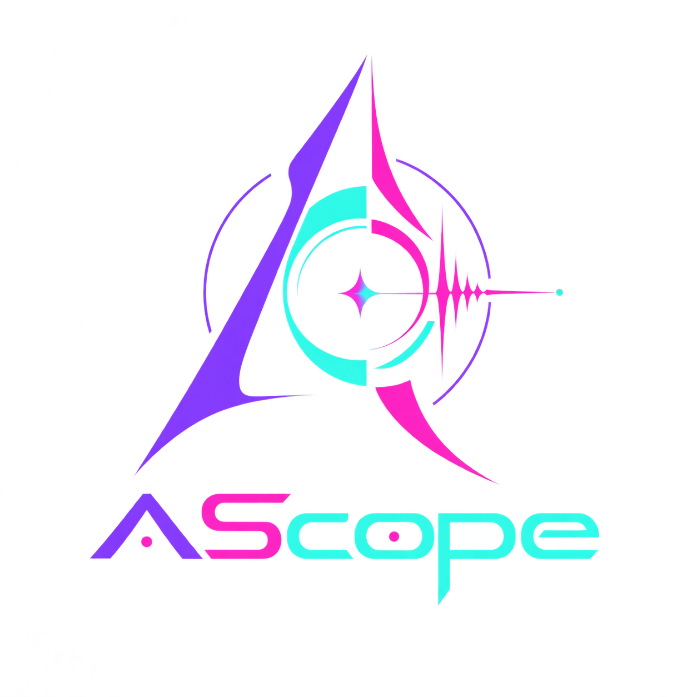
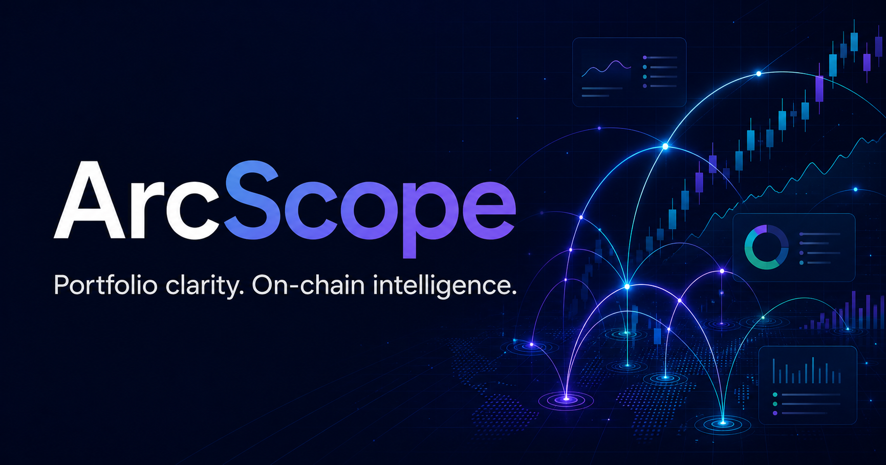

# ArcScope

[](https://nextjs.org/) [](https://www.typescriptlang.org/) [](https://tailwindcss.com/)

ArcScope is an Arc Testnet Web3 workspace that combines a personal portfolio with real-time on-chain analytics. Every wallet, explorer, gas, and network view uses Arc Testnet exclusively.

## Screenshots

### Arc Testnet workspace

The current interface is configured exclusively for Arc Testnet, including native USDC fees, live blocks, wallet analytics, and Arcscan links.

<table>
  <tr>
    <td width="36%" align="center">
      
    </td>
    <td width="64%" align="center">
      
    </td>
  </tr>
  <tr>
    <td align="center"><strong>ArcScope identity</strong><br />Arc-inspired on-chain intelligence</td>
    <td align="center"><strong>Arc Testnet workspace</strong><br />Portfolio clarity and real-time network analytics</td>
  </tr>
</table>

| View | Route | Current scope |
| --- | --- | --- |
| Dashboard | `/dashboard` | Arc Testnet blocks, USDC gas, whale alerts, and ecosystem movers |
| Portfolio | `/portfolio` | Connected-wallet assets and Arc Testnet activity |
| Gas tracker | `/analytics/gas` | Arc fees displayed in USDC with Gwei as a technical detail |

## Features

- RainbowKit wallet connection powered by wagmi v2 and viem v2
- Arc Testnet is the primary network (Chain ID `5042002`) with native USDC gas
- Aggregated token portfolio, allocation, net-worth history, and wallet profile
- NFT gallery, filters, detail modal, traits, and paginated data hooks
- Transaction history, yearly activity heatmap, CSV export, and explorer links
- DeFi positions for major protocols and DAO governance membership detection
- Token price candles, transfer volume, holder distribution, and recent transfers
- Wallet balance history, transaction frequency, and contract interaction treemap
- Live gas tiers, 24-hour history, weekly heatmap, and transaction estimator
- Real-time block subscription with reconnect backoff and heartbeat
- Whale transfer alerts, market movers, NFT trends, and network comparisons
- Persisted watchlist and settings with JSON import/export
- Universal address, ENS, transaction, and token search with local history
- Responsive desktop sidebar, tablet layout, and mobile bottom navigation
- Accessible loading, empty, error, and retry states throughout the application

## Getting started

1. Clone the repository and enter it.

   ```bash
   git clone <your-repository-url>
   cd arcscope
   ```

2. Install dependencies.

   ```bash
   npm install
   ```

3. Copy the environment template.

   ```bash
   cp .env.example .env.local
   ```

4. Add your API keys to `.env.local`.

5. Start the development server.

   ```bash
   npm run dev
   ```

6. Open [http://localhost:3000](http://localhost:3000). The root route redirects to `/dashboard`.

## API key setup

- [Arc](https://docs.arc.io/arc/references/connect-to-arc): ArcScope uses Circle's official public Arc Testnet RPC and WebSocket endpoints by default. Override them with `NEXT_PUBLIC_ARC_RPC_URL` and `NEXT_PUBLIC_ARC_WS_URL` when using a managed provider.
- [WalletConnect Cloud](https://cloud.walletconnect.com/): create a project and set `NEXT_PUBLIC_WALLETCONNECT_PROJECT_ID` so RainbowKit can initialize production wallet connectors.
- [CoinGecko](https://www.coingecko.com/en/api): the public API works for development; set `NEXT_PUBLIC_COINGECKO_API_KEY` if your plan provides a key and higher rate limits.

Without provider keys, the interface uses realistic demonstration data so every route remains explorable. Add production keys before using live data in a deployed application.

## Project structure

```text
app/                  Next.js App Router pages and server API routes
components/
  analytics/          Gas, token, wallet, and network visualizations
  dashboard/          Live blocks, whale alerts, stats, and movers
  layout/             Sidebar, top bar, search, and responsive navigation
  portfolio/          Assets, NFTs, activity, DeFi, and DAO views
  providers/          Theme, Query, wagmi, and RainbowKit boundaries
  shared/             Reusable shadcn-based interface building blocks
  trending/           Token, NFT, and network trend surfaces
  watchlist/          Persisted saved-item management
hooks/                 Query hooks, WebSocket subscriptions, and UI utilities
lib/                   Chains, provider clients, validation, types, and formatting
stores/                Persisted Zustand settings and watchlist state
public/                Chain, token, NFT fallback, and social-preview assets
```

## Deployment

ArcScope is ready for Vercel. Import the repository at [vercel.com/new](https://vercel.com/new), add the variables from `.env.example`, and deploy. Set `NEXT_PUBLIC_APP_URL` to the production origin so Open Graph images resolve absolutely.

[](https://vercel.com/new/clone)

Before deployment, verify locally:

```bash
npm run typecheck
npm run build
```

## Contributing

1. Create a focused branch from `main`.
2. Keep TypeScript strict and avoid untyped provider responses.
3. Add loading, empty, and error states to new server-data components.
4. Test desktop and mobile layouts, then run typecheck and build.
5. Open a pull request describing behavior, data-provider impact, and screenshots.

## License

Released under the MIT License. See [LICENSE](./LICENSE).
